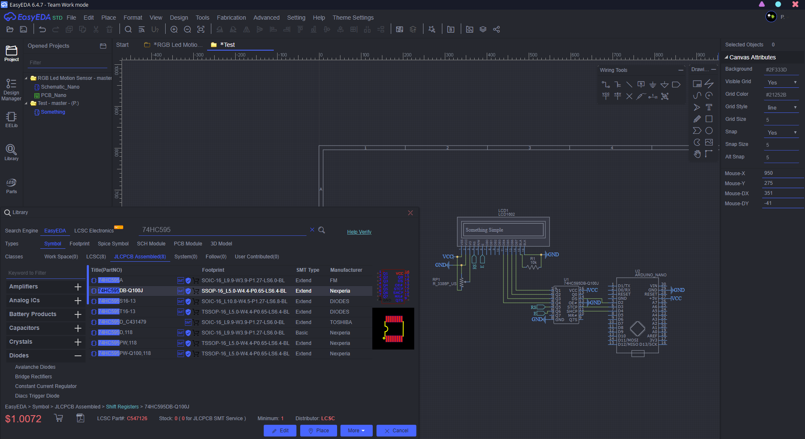
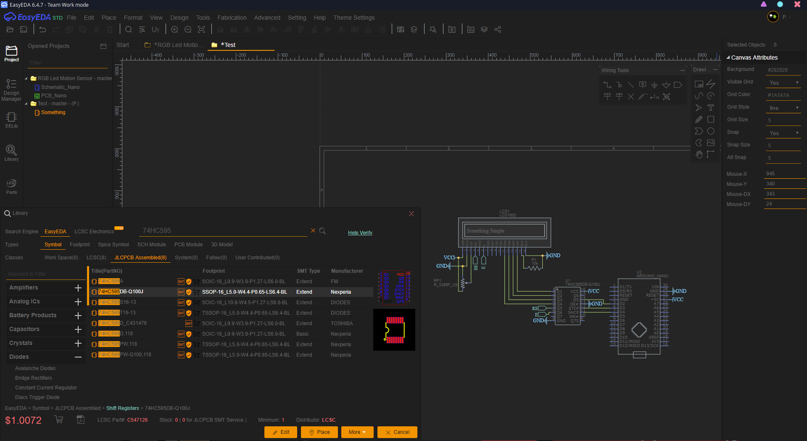
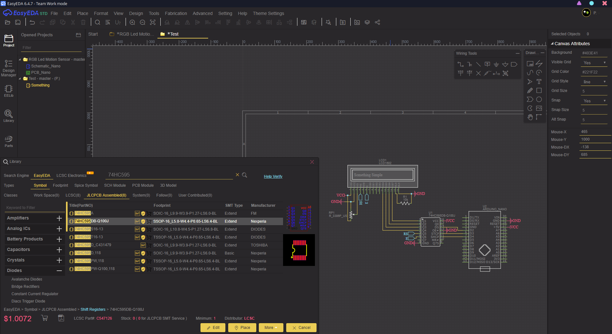
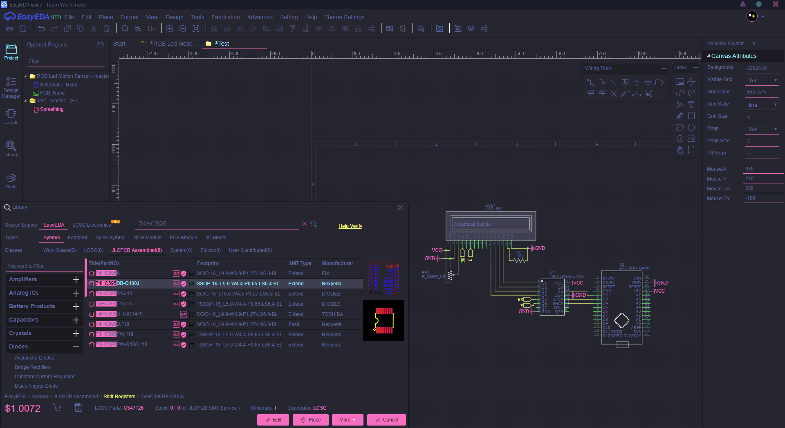
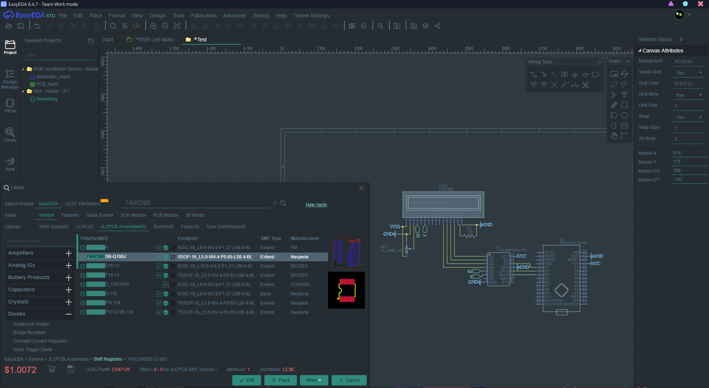
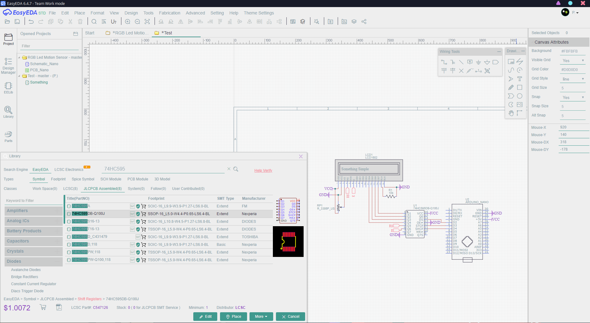

# EasyEda Themes Extension

## 📖 Overview

This extension revamps the entire EasyEda UI with several unique **Dark** 🕶️ and some **Light** themes.

It is all contained in an extension that can run on the EasyEda website or standalone app, in any browser (tested chrome and firefox).

## 💾 Installing 

1) Download the repository or [release](https://github.com/FiercestT/EasyEdaThemes/releases/).
2) Now in EasyEda, open the extensions window by going to: `Advanced > Extensions > Extensions Settings`.
3) Select `Load Extension > Select Files`.
4) Select **all** of the files from the `extension` folder from the downloaded repository.
5) **Make sure** that the `Extension ID` field says `themes`. Then load the extension.
6) Thats it! The themes extension is now mounted.
7) You can now go to `Theme Settings > Select Theme` to select a theme.

Note: If you remount the extension, it is reccomended that you reload the page (`Right Click > Reload` on standalone app).

## 📷 Screenshots

Some notable themes.

One Dark

Darker

Monokai Pro

Dracula

Oceanic

Light Owl

## 🔨 Contributing

Whether you want to add to the project, edit it for yourself, or fix some CSS that I missed, the following can help you out a bit when it comes to the project and EasyEda extensions.

### File Structure

| File             | Description                                                                         |
|------------------|---------------------------------------------------------------------------------|
| exposeapi.js     | Exposes the api() to be called in the developer console.                        |
| main.js          | The main code for the extension.                                                |
| manifest.json    | Must be present to identify the extension.                                      |
| style.txt        | The CSS styling. It is a .txt as .css is not allowed to be uploaded in EasyEda. |
| themes.json      | Themes and their colors.                                                        |
| /extra/style.css | Use this to develop the CSS, when uploading, copy this over to style.txt        |

### CSS Considerations

- Extensions can only mount certain filetypes (js, jpg, png, gif, svg, txt, json, md). 
- Because of the above, the stylesheet mounted is uploaded as a .txt file. The actual stylesheet for development purposes can be found in `extra/style.css`. It can then be copied over to the txt for upload.
- To make CSS editing much easier, there is a tool in `Theme Settings > Edit CSS`, which allows you to update the CSS without remounting the extension. You can also force reload the CSS in this dialog.

### Other Considerations

- All theme info is stored in `themes.json`, you can simply add a new theme by adding to the json using the existing structure.
- EasyEda can load resources that were uploaded, in this case: `themes.json` and `style.txt`; Using an api call. These are loaded as blobs and must be processed.
- EasyEda has some basic documentation and outdated examples for their api. You can use developer tools and prettify the main.min.js, and explore it to see what api calls are possible and what arguments should be used.
